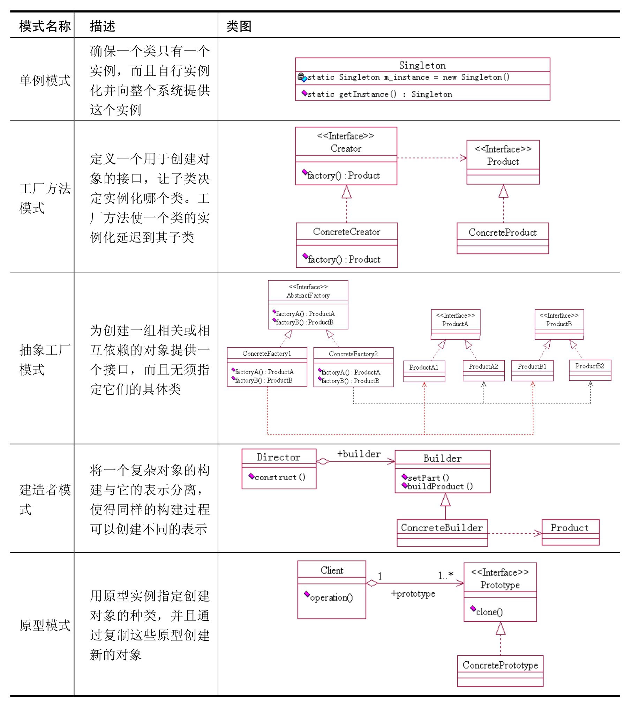
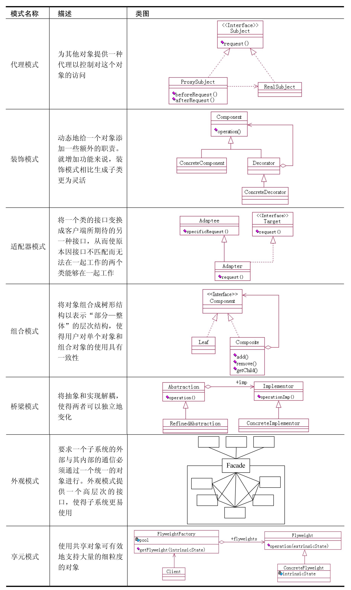
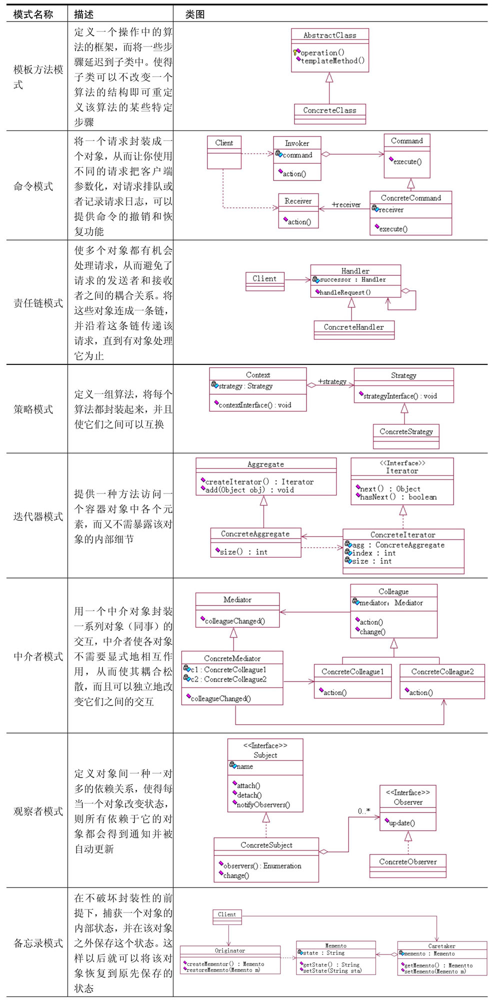
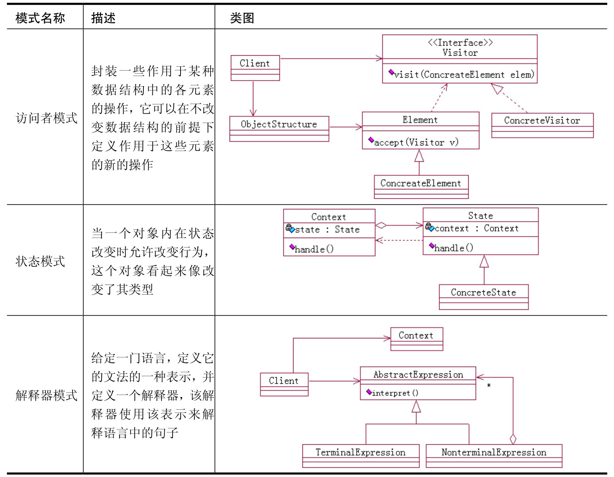

# 数据结构和算法、设计模式

##创建型  
  
##结构型  
  
##行为型  
  
  

设计原则只是一个理论，而不是一个带刻度的标尺，因此在系统设计中不应该把它视为不可逾越的屏障，而是应该把它看成
一个方向标，尽量遵守，而不是必须恪守。  

工厂方法、建造者和抽象工厂之间的差异：  
工厂方法模式通过不同的工厂生产不同的超人，主要注重创建方法。  
建造者模式则需要通过不同的建造者组装超人的各部分组件，然后通过导演类调用建造者的具体建造方法建造超人，最后
通过建造者返回超人。建造者模式注重创建的过程。  
抽象工厂模式通过不同的工厂生产一系列的超级英雄，注重完整性。  

代理、装饰和适配器模式之间的差异：  
装饰模式是代理模式的一个特殊应用，虽然它们都具有相同的接口，但装饰器是对类的功能进行加强或减弱，重点是类的功能
变化；而代理模式着重代理过程的控制。  
装饰模式和适配器模式都能对类进行“包装”，但装饰模式包装的是同一家族（相同接口或父类）的对象，主要是将非本家族的对象
伪装成同一家族对象。  

命令和策略模式的差异：  
策略模式是封装算法，认为算法是一个完整的、不可拆分的原子业务，其目的是让这些算法独立，并且可以相互替换，让行为的变化独立于
拥有行为的客户。  
命令模式则是对动作的解耦，把一个动作的执行分为执行对象（接受者对象）、执行行为（命令角色），让两者相互独立而互不影响。  

######参考  
《设计模式(Java版)》  
《数据结构(Java语言描述)》